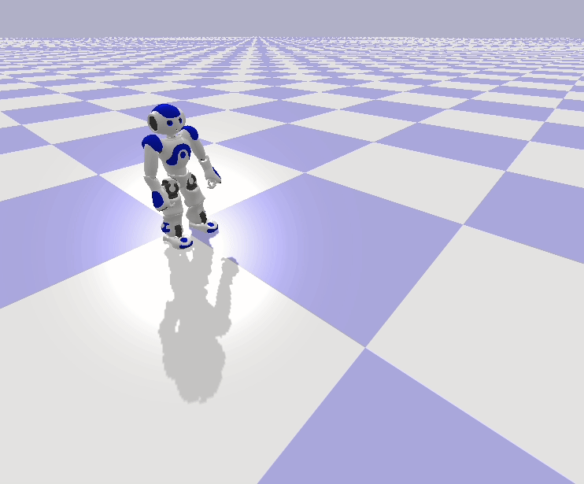

# qiBullet [](https://github.com/softbankrobotics-research/qibullet/actions?query=workflow%3Aci) [](https://codecov.io/gh/softbankrobotics-research/qibullet) [](https://pypi.org/project/qibullet/) [](https://pepy.tech/project/qibullet) [](https://github.com/softbankrobotics-research/qibullet/discussions) [](https://softbankrobotics-research.github.io/qibullet/)

__Bullet-based__ python simulation for __SoftBank Robotics'__ robots.

<!-- start -->
<p align="middle">
	
	
	
</p>
<p align="middle">
	
	
</p>
<!-- end -->

## Installation

The following modules are required:
* __numpy__
* __pybullet__

The qiBullet module can be installed via pip, for python 2.7 and python 3:
```bash
pip install --user qibullet
```

Additional resources (robot meshes and URDFs) are required in order to be able to spawn a Pepper, NAO or Romeo robot in the simulation. These extra resources will be installed in your home folder:
* `/home/username/.qibullet` on Linux and macOS
* `C:\Users\username\.qibullet` on Windows

The installation of the additional resources will automatically be triggered if you try to spawn a Pepper, NAO or Romeo for the first time. If qiBullet finds the additional resources in your local folder, the installation won't be triggered. The robot meshes are under a specific [license](https://github.com/softbankrobotics-research/qibullet/tree/master/qibullet/robot_data/LICENSE), you will need to agree to that license in order to install them. More details on the installation process can be found on the [wiki](https://github.com/softbankrobotics-research/qibullet/wiki).

## Usage
A robot can be spawned via the SimulationManager class:
```python
import sys
from qibullet import SimulationManager

if __name__ == "__main__":
    simulation_manager = SimulationManager()

    # Launch a simulation instances, with using a graphical interface.
    # Please note that only one graphical interface can be launched at a time
    client_id = simulation_manager.launchSimulation(gui=True)

    # Selection of the robot type to spawn (True : Pepper, False : NAO)
    pepper_robot = True

    if pepper_robot:
      # Spawning a virtual Pepper robot, at the origin of the WORLD frame, and a
      # ground plane
      pepper = simulation_manager.spawnPepper(
          client_id,
          translation=[0, 0, 0],
          quaternion=[0, 0, 0, 1],
          spawn_ground_plane=True)
    else:
      # Or a NAO robot, at a default position
      nao = simulation_manager.spawnNao(
          client_id,
          spawn_ground_plane=True)

    # This snippet is a blocking call, just to keep the simulation opened
    if sys.version_info[0] >= 3:
      input("Press a key to end the simulation")
    else:
      raw_input("Press a key to end the simulation")
    
    # Stop the simulation
    simulation_manager.stopSimulation(client_id)
    
```

Or using loadRobot from the PepperVirtual class if you already have a simulated environment:
```python
    pepper = PepperVirtual()

    pepper.loadRobot(
      translation=[0, 0, 0],
      quaternion=[0, 0, 0, 1],
      physicsClientId=client_id)
```

More snippets can be found in the [examples folder](https://github.com/softbankrobotics-research/qibullet/tree/master/examples), or on the [wiki](https://github.com/softbankrobotics-research/qibullet/wiki)

> :warning: The camera subscription system of qiBullet 1.4.0 (and lesser) is __deprecated__, use the [new system](https://github.com/softbankrobotics-research/qibullet/wiki/Tutorials:-Virtual-Robot#cameras)

## Documentation
The qiBullet __API documentation__ can be found [here](https://softbankrobotics-research.github.io/qibullet/). In order to build the documentation, the __doxygen__ package has to be installed beforehand and the docs folder has to exist. The submodules should also be checked out:
```bash
git submodule init
git submodule update
```

The documentation can then be generated via the following command:
```bash
cd docs
doxygen Doxyfile
```

The repository also contains a [wiki](https://github.com/softbankrobotics-research/qibullet/wiki), providing some tutorials.

## Citations
Please cite qiBullet if you use this repository in your publications:
```
@article{busy2019qibullet,
  title={qiBullet, a Bullet-based simulator for the Pepper and NAO robots},
  author={Busy, Maxime and Caniot, Maxime},
  journal={arXiv preprint arXiv:1909.00779},
  year={2019}
}
```

## Troubleshooting

### OpenGL driver
If you encounter the message:
> Workaround for some crash in the Intel OpenGL driver on Linux/Ubuntu

Your computer is using the Intel OpenGL driver. Go to __Software & Updates__, __Additional Drivers__, and select a driver corresponding to your GPU.

## License
Licensed under the [Apache-2.0 License](LICENSE)
